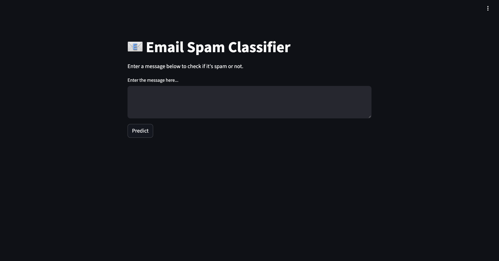
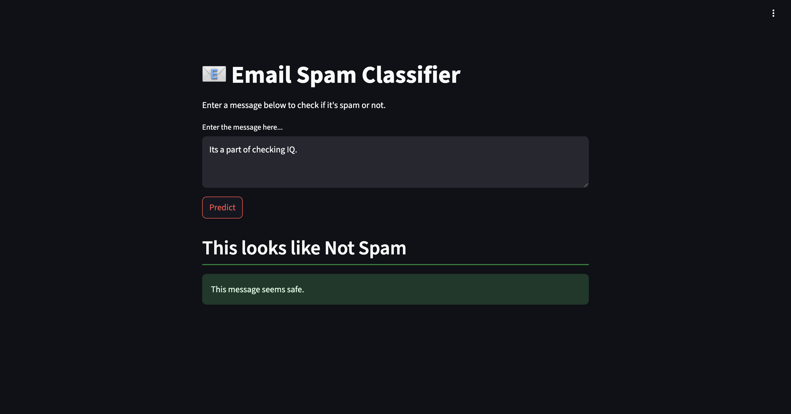

# Email Spam Classifier 📧
The Email/SMS Spam Classifier is a machine learning project designed to categorize text messages as either Spam or Not Spam. It utilizes a Multinomial Naive Bayes model and features a Streamlit-based web interface for real-time predictions. The project includes a Jupyter Notebook that details the data analysis, model training, and evaluation processes.

## 🚀 Live Demo
The most effective way to understand this project is to interact with it directly. The application is deployed and publicly accessible.

[Project Demo](https://emailclassification-adnan.onrender.com/)

## 📋 Project Architecture
The project follows a standard machine learning workflow, from data exploration to deployment. The architecture is outlined below:

User Input (Message): The user provides a message to be classified.

Streamlit Web App (app.py): The web interface for user interaction.

Text Preprocessing Function: This function prepares the text for the model by performing the following steps:

* Lowercase conversion

* Tokenization

* Removal of special characters

* Removal of stopwords

* Stemming

* TF-IDF Vectorization: The preprocessed text is converted into a numerical format using the TF-IDF vectorizer loaded from vectorizer.pkl.

* Multinomial Naive Bayes Model: The model, loaded from model.pkl, makes the prediction.

* Prediction Output: The result is displayed as "Spam" or "Not Spam."

## ⚙️ Project Workflow
The analysis and model development were conducted in the spamClassification.ipynb notebook and involved the following key steps:

### 1. Data Cleaning
Dataset Loading: The SMS Spam Collection dataset was loaded from a .csv file.

Redundancy Removal: Irrelevant columns were dropped, and duplicate entries were removed to ensure data quality.

Label Standardization: The categorical labels ('ham', 'spam') were converted into numerical format (0 for ham, 1 for spam) using a label encoder.

### 2. Exploratory Data Analysis (EDA)
Class Distribution: The distribution of spam versus ham messages was analyzed, revealing an imbalanced dataset (approximately 87% ham, 13% spam).

Feature Engineering: New features were created to better understand the data, including the number of characters, words, and sentences.

Visual Analysis: Histograms and word clouds were generated for both spam and ham messages. Key insights included that spam messages generally contain more characters and words, with words like "free," "win," "claim," "prize," and "urgent" being highly frequent.

### 3. Text Preprocessing
A comprehensive preprocessing pipeline was implemented to transform raw text data into a clean, machine-readable format. This involved:

Lowercasing: All text was converted to lowercase.

Tokenization: Sentences were broken down into individual words (tokens).

Special Character Removal: Non-alphanumeric characters were filtered out.

Stopword & Punctuation Removal: Common English stopwords and punctuation were eliminated.

Stemming: Words were reduced to their root form using the Porter Stemmer.

### 4. Model Building
Vectorization: The TF-IDF (Term Frequency-Inverse Document Frequency) technique was used to convert the preprocessed text into numerical feature vectors, limited to the top 3000 most frequent words.

Model Comparison: Eleven different classification algorithms were trained and evaluated to identify the best performer, including Naive Bayes, Logistic Regression, Support Vector Machine (SVC), K-Nearest Neighbors (KNN), Decision Tree, Random Forest, and various ensemble methods.

## 🏆 Model Selection and Performance
After a thorough comparison, the Multinomial Naive Bayes (MNB) classifier was selected for its high accuracy and perfect precision, which is crucial for minimizing the misclassification of legitimate messages as spam.

The performance of the MNB model on the test dataset was as follows:

### Metric	Score
Accuracy	97.10%  
Precision	1.00

Export to Sheets
### Confusion Matrix:

[[896   0]  
 [ 30 108]]      
True Negatives: 896 (Ham correctly identified)

False Positives: 0 (Ham incorrectly marked as Spam)

False Negatives: 30 (Spam incorrectly marked as Ham)

True Positives: 108 (Spam correctly identified)

The Precision score of 1.0 indicates that 100% of the messages predicted as spam were indeed spam.

## 💻 Technologies & Libraries Used
Language: Python 3

Data Analysis: Pandas, NumPy

Data Visualization: Matplotlib, Seaborn, WordCloud

Text Processing: NLTK (Natural Language Toolkit)

Machine Learning: Scikit-learn, XGBoost

## Web App: Streamlit

🚀 Setup and Usage
To run this project on your local machine, follow these steps:

### Clone the Repository:

Bash

git clone https://github.com/afadnan/emailSpamClassification  
cd emailSpamClassification  
Create a Virtual Environment:  

Bash

conda create  -p venvspam python==3.12  
source venv/bin/activate    
On Windows, use `venv\Scripts\activate`  
Install Dependencies:  
Create a requirements.txt file with the following content:  

ipykernel==6.30.1   
pandas==2.3.1  
numpy==2.3.1  
matplotlib==3.10.3  
seaborn==0.13.2  
scikit-learn==1.7.1  
streamlit==1.47.1  
nltk==3.9.1  
wordcloud==1.9.4  
xgboost==3.0.3  

Then, install the libraries:

Bash

pip install -r requirements.txt  
Download NLTK Data:  
Run the following command in a Python interpreter to download the necessary NLTK packages:  

Python

import nltk  
nltk.download('punkt')  
nltk.download('stopwords')  
Run the Streamlit App:  

Bash

streamlit run app.py  
Open your web browser and navigate to the local URL provided by Streamlit (usually http://localhost:8501).

## 🖼️ Application Showcase

The following screenshots provide a visual tour of the application's user interface and functionality. They serve as a quick preview for those who may not run the live demo.

This shows the main interface with all the input fields a user can configure to specify their desired laptop.

Example Prediction Result
This screenshot captures the application after a user has entered their specifications and received a price prediction from the model.

## 🤝 How to Contribute
Contributions, issues, and feature requests are welcome! If you have suggestions for improvement, please open an issue or submit a pull request on GitHub.
